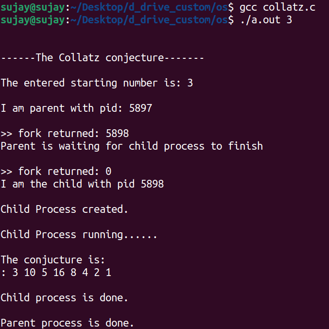

# Question 3.21 - Chapter: Processes

## Statement:

The Collatz conjecture concerns what happens when we take any positive integer n and apply the following algorithm:


<p>The conjecture states that when this algorithm is continually applied,
all positive integers will eventually reach 1.<br> For example, if n = 35, the
sequence is<p>
<p align="center">35, 106, 53, 160, 80, 40, 20, 10, 5, 16, 8, 4, 2, 1<p>
<p>Write a C program using the fork() system call that generates this sequence in the child process. The starting number will be provided 
from the command line. For example, if 8 is passed as a parameter on the command line, the child process will output 8, 4, 2, 1. Because the
parent and child processes have their own copies of the data, it will be necessary for the child to output the sequence. Have the parent invoke
the wait() call to wait for the child process to complete before exiting the program. Perform necessary error checking to ensure that a positive
integer is passed on the command line.<p>
  
## Instructions
[collatz.c]( name.c) - source code for Collatz conjecture program
  
#### Instructions to follow while compiling this code
Enter the following on the command line<br>
1. ``` gcc collatz.c  ```
  
The starting number is provided on the command line:<br> 
  
2. ``` ./a.out {starting number} ```

The result will be displayed on the command line.

## Demo

#### The result for n = 3 is shown below:<br>



The following function calls are used:

1.  `fork()`

    -   Used to create a child process out of parent process.
    -   In parent it returns the process ID of the created process.
    -   In the child it returns 0;
    -   Parent and child process executes concurrently.

2.  `wait()`
    -   Parent will wait for the child to complete.
    -   once child terminates, parent will continue execution.

## Credits

-   [https://github.com/RoystonDsouza42/CS252/tree/main/Question%203.21](https://github.com/RoystonDsouza42/CS252/tree/main/Question%203.21)

Note: Source code was taken from [@RoystonDsouza42](https://github.com/RoystonDsouza42)'s repo and minor changes were made to it.
