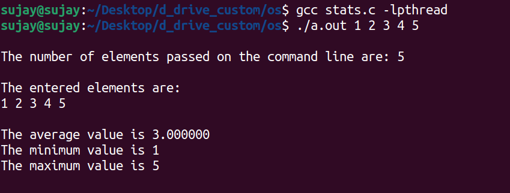

# Question 4.22 - Chapter 4 Threads & Concurrency

## Statement

<p>Write a multithreaded program that calculates various statistical values
for a list of numbers. This program will be passed a series of numbers
on the command line and will then create three separate worker threads.
One thread will determine the average of the numbers, the second will
determine the maximum value, and the third will determine the minimum
value. For example, suppose your program is passed the integers<p>
<p align = "center">90 81 78 95 79 72 85<p>
The program will report<br>
<p>The average value is 82<br>
The minimum value is 72<br>
The maximum value is 95<br><p>
The variables representing the average, minimum, andmaximum values
will be stored globally. The worker threads will set these values, and
the parent thread will output the values once the workers have exited.
(We could obviously expand this program by creating additional threads
that determine other statistical values, such as median and standard
deviation.)

## Source Code

[stats.c](https://github.com/sujay000/CS252/blob/main/Question_4.22/stats.c)

### Instructions

-   Download/Clone the Github repo.

```sh
git clone https://github.com/sujay000/CS252.git
```

```sh
cd CS252/Question_4.22
```

-   Compile the program

```sh
gcc stats.c -lpthread
```

-   Run the compiled program and enter the data

```sh
./a.out {data...}
```

## Demo

#### The result: maximum, minimum, average are displayed on the command line.<br>



The following thread fuctions and declarations were used:

1. ` pthread_t {thread name }`

    - Used to declare a thread.
    - store the thread ID of the new thread.
    - example : `pthread_t t1;`

2. `int pthread_create(pthread_t *thread, pthread_attr_t *attr, void *(*start_routine) (void *arg), void *arg);`

    - thread: location where the thread ID is stored
    - attr: structure that specifies the attributes of the new thread.
    - start_routine: routine where the thread begins.
    - arg : arguments to pass to start_routine.
    - example : `pthread_create(&t1,NULL,&avg,NULL);`

3. ` void pthread_exit(void *status);`

    - Used to terminate a thread.
    - example : `pthread_exit(NULL);`

4. `int pthread_join(pthread_t thread, void **status);`

    - Used to wait for the termination of a thread
    - example : `pthread_join(t1,NULL);`

## Credits

-   [https://github.com/RoystonDsouza42/CS252/tree/main/Question%204.22](https://github.com/RoystonDsouza42/CS252/tree/main/Question%204.22)

Note: Source code was taken from [@RoystonDsouza42](https://github.com/RoystonDsouza42)'s repo and minor changes were made to it.

## Resources

The following were used to understand the concept and the code

-   [https://youtu.be/d9s_d28yJq0](https://youtu.be/d9s_d28yJq0)

-   [https://youtu.be/ln3el6PR\_\_Q](https://youtu.be/ln3el6PR__Q)

-   [https://youtu.be/w_8bFrHUK5Q](https://youtu.be/w_8bFrHUK5Q)
